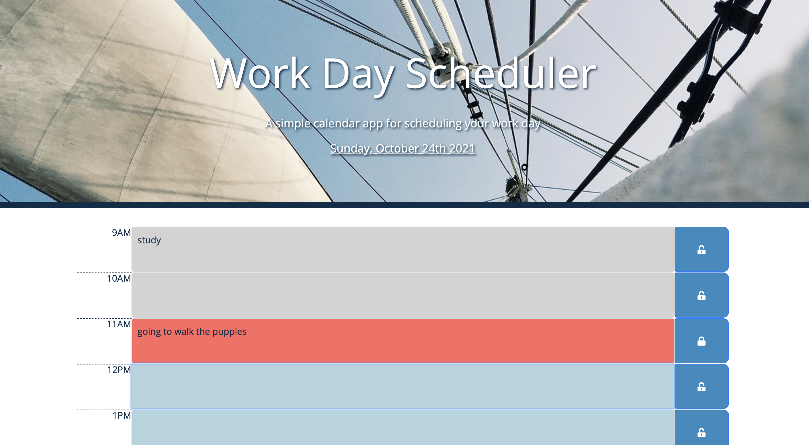

# Work Day Scheduler

## Description

This is a simple calender application that designed to help a user to save the events for each hour of the busy work day.
The user will find the current date on the top of the page.
When the user scrolls down, he/she is able to input his/her events into business time hours from 9:00AM to 5:00PM. 
The lock buttons are to edit and save the events from textarea. User needs to unlock the button in order to remove or edit current events. After removal/editting of the events, lock button needs to be clicked again. Otherwise, when the browser is refreshed, the previous events will remain the same. 
Each time block will be presented in light grey, orange red and baby blue to show if it is in the past, present, or future.
Hope this application will be helpful for the user with busy work days.
Thank you and enjoy!

## Built with

* HTML
* CSS
* JQuery
* Moment.js

## Usage

The following image demonstrates the web application's appearance and functionality:

## Websites

https://flowingcityloy.github.io/Work-Day-Scheduler/ (Links to an external site.)

https://github.com/flowingcityloy/Work-Day-Scheduler

## Credits

❤️ Made with love by Lydia Loy ❤️

